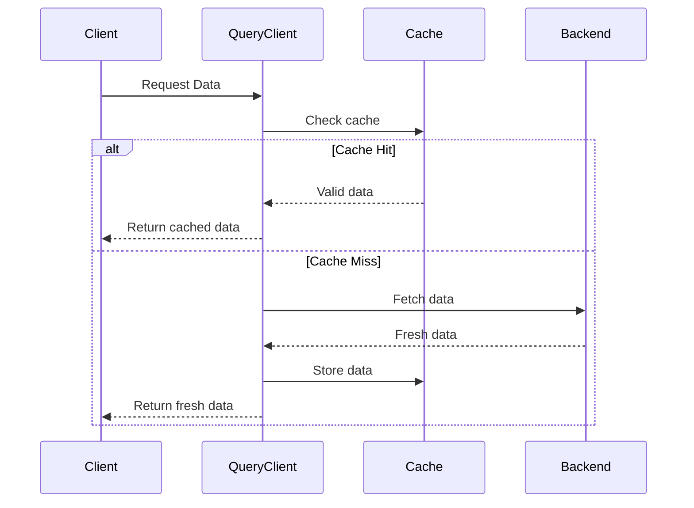
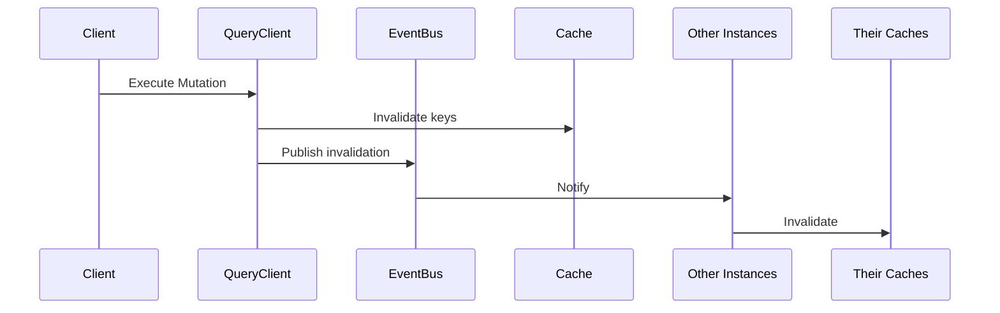
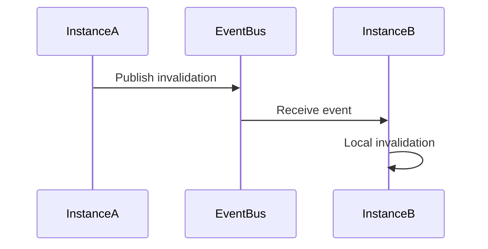

## Overview
Invalid8 is a sophisticated caching library for .NET applications that provides:

- Intelligent query caching with configurable stale/expiration times
- Automatic cache invalidation for mutations
- Distributed cache synchronization via event bus
- Resilient retry mechanisms and background refresh
## Core Concepts
### 1. Cache Lifecycle

### 2. Cache Invalidation

## API Reference
### Core Methods
#### `UseCachedQueryAsync<T>(string[] key, Func<Task<T>> queryMethod, CacheQueryOptions? options)` 
**Purpose**: Execute a query with caching support
**Parameters**:

- `key` : Array representing the cache key (e.g., `["users", "id123"]` )
- `queryMethod` : Function to fetch data if not in cache
- `options` : Cache configuration (stale time, cache time, etc.)
**Flow**:

1. Checks cache first
2. Returns cached data if valid
3. Fetches fresh data if cache miss/stale
4. Updates cache in background if stale
#### `UseMutateQueryAsync<T>(string[] key, Func<Task<T>> mutationFunc, MutationOptions? options)` 
**Purpose**: Execute a mutation with automatic cache invalidation
**Parameters**:

- `key` : Primary cache key to invalidate
- `mutationFunc` : Mutation operation
- `options` : Invalidation configuration
**Flow**:

1. Executes mutation
2. Invalidates specified cache keys
3. Publishes invalidation events
### Configuration Options
#### `CacheQueryOptions` 
| Property | Type | Default | Description |
| ----- | ----- | ----- | ----- |
| StaleTime | TimeSpan? | 5 min | Time before data is considered stale |
| CacheTime | TimeSpan? | 30 min | Time before data expires |
| RetryCount | int | 3 | Number of retry attempts |
| RetryDelay | TimeSpan | 1 sec | Delay between retries |
| EnableBackgroundRefetch | bool | true | Whether to refresh stale data in background |
#### `MutationOptions` 
| Property | Type | Default | Description |
| ----- | ----- | ----- | ----- |
| InvalidateQueries | bool | true | Whether to invalidate cache |
| InvalidationKeys | List<string[]> | Empty | Additional keys to invalidate |
## Setup Guide
### 1. Redis + Kafka (Production)
```csharp
services.AddStackExchangeRedisCache(options => 
    options.Configuration = "redis-server:6379");
    
services.AddRedisCacheProvider();
services.AddKafkaEventProvider("kafka-server:9092", "my-app-group");
services.AddQueryClient();
```
### 2. In-Memory (Development)
```csharp
services.AddInMemoryCacheProvider();
services.AddInMemoryEventProvider();
services.AddQueryClient();
```
## Usage Examples
### Basic Query
```csharp
public async Task<QueryResult<User>> GetUser(int userId)
{
    return await _queryClient.UseCachedQueryAsync<User>(
        key: new[] { "users", userId.ToString() },
        queryMethod: () => _userRepository.GetUserAsync(userId),
        options: new CacheQueryOptions
        {
            StaleTime = TimeSpan.FromMinutes(5),
            CacheTime = TimeSpan.FromHours(1)
        });
}
```
### Mutation with Invalidation
```csharp
public async Task<User> UpdateUser(User user)
{
    return await _queryClient.UseMutateQueryAsync<User>(
        key: new[] { "users", user.Id.ToString() },
        mutationFunc: () => _userRepository.UpdateUserAsync(user),
        options: new MutationOptions
        {
            InvalidationKeys = new List<string[]>
            {
                new[] { "users", user.Id.ToString() },
                new[] { "users", "list" }
            }
        });
}
```
## Advanced Features
### 1. Background Refresh
When data becomes stale but isn't expired:

1. Returns stale data immediately
2. Asynchronously refreshes data in background
3. Updates cache for subsequent requests
### 2. Resilient Retries
Automatic retry mechanism for:

- Cache operations
- Query executions
- Event publishing
### 3. Distributed Invalidation

## Best Practices
1. **Key Design**:
    - Use consistent key structures (e.g., `["entity-type", "id"]` )
    - For lists, use prefix keys (e.g., `["users", "list"]` )
2. **Timeouts**:
    - Set `StaleTime`  shorter than `CacheTime` 
    - Adjust based on data volatility
3. **Monitoring**:
    - Log cache hit/miss ratios
    - Monitor background refresh failures
## Troubleshooting
| Symptom | Possible Cause | Solution |
| ----- | ----- | ----- |
| Stale data returned | Background refresh failed | Check logs for refresh errors |
| Cache not invalidating | Event bus issues | Verify event provider connectivity |
## Performance Characteristics
| Operation | Average Latency | Notes |
| ----- | ----- | ----- |
| Cache Hit | 1-5ms | Depends on cache provider |
| Cache Miss | Query latency + 5-10ms | Includes cache population |
| Mutation | Query latency + 10-20ms | Includes invalidation overhead |


