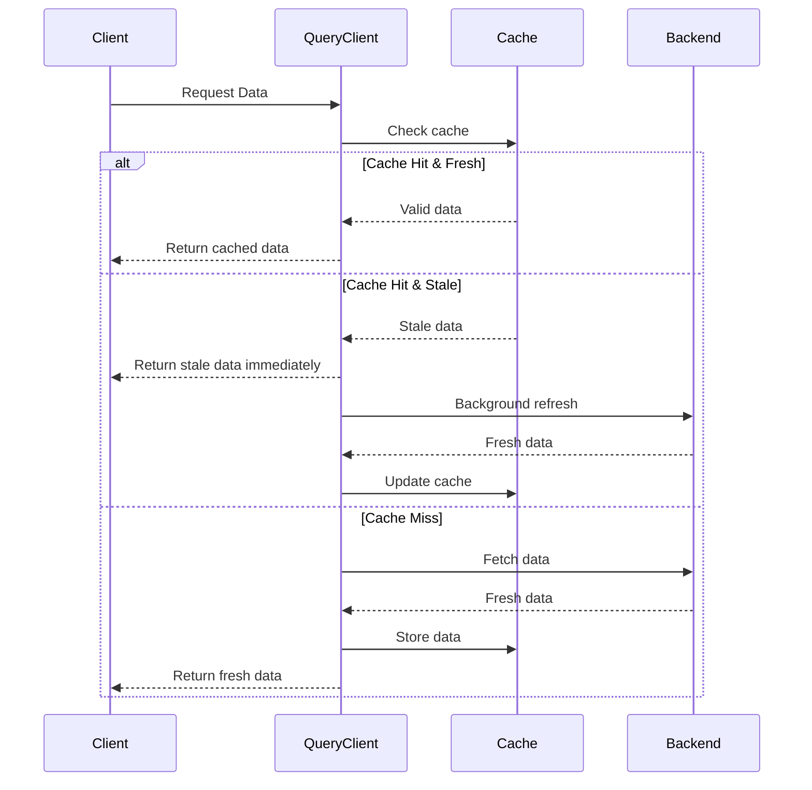
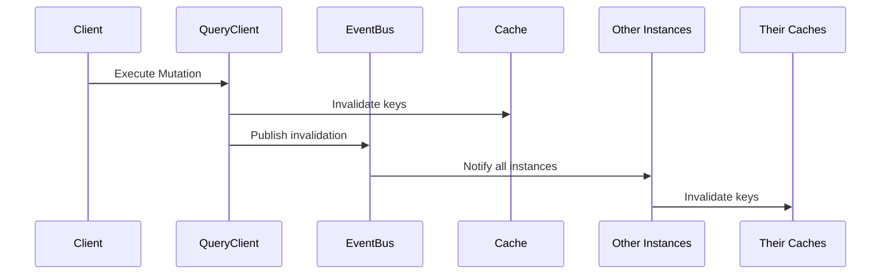
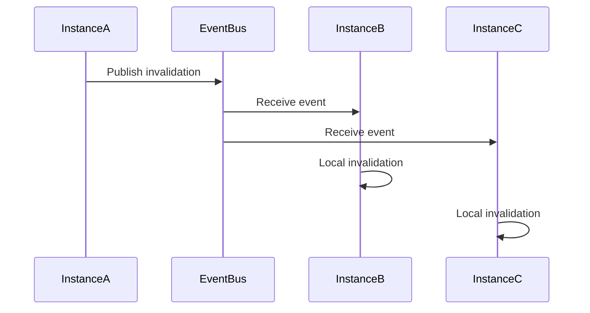

# Invalid8 Caching Library Documentation

## Overview

Invalid8 is a sophisticated, high-performance caching library for .NET applications designed specifically for modern distributed systems and CQRS architectures. It provides intelligent query caching with configurable stale/expiration times, automatic cache invalidation for mutations, distributed cache synchronization via event bus, and resilient retry mechanisms.

**Key Features:**
- 🚀 **React Query-like DX** for .NET with familiar patterns
- 🌐 **Distributed cache synchronization** across multiple instances
- ⚡ **High performance** with minimal overhead
- 🛡️ **Resilient design** with circuit breakers and retry policies
- 📊 **Comprehensive observability** with metrics and logging
- 🎯 **CQRS-optimized** for read/write separation

## Core Concepts

### 1. Cache Lifecycle



### 2. Cache Invalidation



## API Reference

### Core Methods

#### `QueryAsync<T>(string[] key, Func<Task<T>> queryFunc, QueryOptions? options = null)`
**Purpose**: Execute a query with caching support

**Parameters**:
- `key` : Array representing the cache key (e.g., `["users", "id123"]`)
- `queryFunc` : Function to fetch data if not in cache
- `options` : Cache configuration (stale time, cache time, etc.)

**Flow**:
1. Checks cache first
2. Returns cached data if valid
3. Fetches fresh data if cache miss/stale
4. Updates cache in background if stale

#### `MutateAsync<T>(Func<Task<T>> mutationFunc, MutationOptions? options = null)`
**Purpose**: Execute a mutation with automatic cache invalidation

**Parameters**:
- `mutationFunc` : Mutation operation
- `options` : Invalidation configuration

**Flow**:
1. Executes mutation
2. Invalidates specified cache keys
3. Publishes invalidation events to distributed cache

#### `SetQueryDataAsync<T>(string[] key, T data, CacheEntryOptions? options = null)`
**Purpose**: Manually update cache data (optimistic updates)

#### `UpdateQueryDataAsync<T>(string[] key, Func<T?, T> updateFunction, CacheEntryOptions? options = null)`
**Purpose**: Transform existing cache data

### Configuration Options

#### `QueryOptions`
| Property | Type | Default | Description |
|----------|------|---------|-------------|
| StaleTime | TimeSpan? | 5 min | Time before data is considered stale |
| CacheTime | TimeSpan? | 30 min | Time before data expires |
| RetryCount | int | 3 | Number of retry attempts |
| RetryDelay | TimeSpan | 1 sec | Delay between retries |
| EnableBackgroundRefetch | bool | true | Whether to refresh stale data in background |
| Tags | string[] | Empty | Tags for categorical invalidation |

#### `MutationOptions`
| Property | Type | Default | Description |
|----------|------|---------|-------------|
| InvalidateQueries | string[][] | Empty | Array of keys to invalidate |
| PublishEvent | bool | true | Whether to publish invalidation events |
| RetryCount | int | 3 | Number of retry attempts |
| Timeout | TimeSpan? | null | Operation timeout |

#### `OptimisticMutationOptions<T>`
| Property | Type | Default | Description |
|----------|------|---------|-------------|
| QueryKeys | string[][] | Required | Keys to update optimistically |
| OptimisticData | Func<T?> | Required | Function to compute optimistic data |
| OnSuccess | Func<T, T> | null | Transform result after success |
| RollbackOnError | bool | true | Whether to rollback on error |
| OnError | Action<Exception> | null | Custom error handler |

## CQRS Implementation Guide

### Query Side Optimization

```csharp
public class GetUserQueryHandler : IQueryHandler<GetUserQuery, UserDto>
{
    private readonly IQueryClient _queryClient;

    public async Task<UserDto> Handle(GetUserQuery query, CancellationToken ct)
    {
        return await _queryClient.QueryAsync(
            key: new[] { "users", query.UserId.ToString() },
            queryFunc: () => _userRepository.GetUserAsync(query.UserId),
            options: new QueryOptions
            {
                StaleTime = TimeSpan.FromMinutes(5),
                CacheTime = TimeSpan.FromHours(1),
                Tags = new[] { "users", $"user:{query.UserId}" }
            });
    }
}
```

### Command Side with Automatic Invalidation

```csharp
public class UpdateUserCommandHandler : ICommandHandler<UpdateUserCommand>
{
    private readonly IQueryClient _queryClient;

    public async Task Handle(UpdateUserCommand command, CancellationToken ct)
    {
        await _queryClient.MutateAsync(
            mutationFunc: () => _userRepository.UpdateUserAsync(command.User),
            options: new MutationOptions
            {
                InvalidateQueries = new[] 
                {
                    new[] { "users", command.User.Id.ToString() },
                    new[] { "users", "list" },
                    new[] { "dashboard", "stats" }
                }
            });
    }
}
```

### Optimistic Updates for Better UX

```csharp
public async Task<Todo> CompleteTodoAsync(int todoId)
{
    return await _queryClient.MutateAsync(
        mutationFunc: () => _api.CompleteTodoAsync(todoId),
        options: new OptimisticMutationOptions<Todo>
        {
            QueryKeys = new[] { new[] { "todos", todoId.ToString() } },
            OptimisticData: () => new Todo { Id = todoId, Completed = true, Title = "Loading..." },
            OnSuccess: result => result with { UpdatedAt = DateTime.UtcNow },
            RollbackOnError: true
        });
}
```

### Distributed Cache Synchronization

```csharp
// Service A (updates data)
await _queryClient.MutateAsync(() => _serviceA.UpdateOrderAsync(order),
    new MutationOptions
    {
        InvalidateQueries = new[] { new[] { "orders", order.Id.ToString() } },
        PublishEvent = true
    });

// Service B (automatically receives invalidation)
await _eventProvider.SubscribeToInvalidationsAsync(async invalidationEvent =>
{
    foreach (var key in invalidationEvent.Keys)
    {
        if (key[0] == "orders")
        {
            await _analyticsService.ClearOrderCache(key[1]);
        }
    }
});
```

## Setup Guide

### 1. Basic In-Memory Setup (Development)

```csharp
// Program.cs
builder.Services.AddInvalid8()
               .AddInvalid8WithInMemoryCache();
```

### 2. Redis Production Setup

```csharp
// Program.cs
builder.Services.AddInvalid8()
               .AddInvalid8WithRedisCache(options =>
                options.Configuration = builder.Configuration.GetConnectionString("Redis"));
```
### 3. Configuration Options

```json
// appsettings.json
{
  "Invalid8": {
    "DefaultStaleTime": "00:05:00",
    "DefaultCacheTime": "00:30:00",
    "EnableBackgroundRefresh": true,
    "MaxRetryAttempts": 3
  },
  "ConnectionStrings": {
    "Redis": "localhost:6379,abortConnect=false"
  }
}
```

## Advanced Features

### 1. Background Refresh
When data becomes stale but isn't expired:
1. Returns stale data immediately
2. Asynchronously refreshes data in background
3. Updates cache for subsequent requests

### 2. Resilient Retries
Automatic retry mechanism for:
- Cache operations
- Query executions
- Event publishing
- Circuit breaker pattern integration

### 3. Distributed Invalidation


### 4. Tag-Based Invalidation
```csharp
// Cache with tags
await _queryClient.SetQueryDataAsync(
    key: new[] { "users", "123" },
    value: user,
    options: new CacheEntryOptions
    {
        Tags = new[] { "department:finance", "region:us" }
    });

// Invalidate by tag
await _cacheProvider.InvalidateByTagAsync("department:finance");
```

## Best Practices

### 1. Key Design
- Use consistent key structures (e.g., `["entity-type", "id"]`)
- For lists, use prefix keys (e.g., `["users", "list"]`)
- Include domain context in keys (e.g., `["tenant:123", "users", "456"]`)

### 2. Timeout Configuration
```csharp
// Set appropriate timeouts based on data volatility
new QueryOptions
{
    StaleTime = TimeSpan.FromSeconds(30),    // Frequently changing data
    CacheTime = TimeSpan.FromMinutes(5)      // Keep in cache longer
}

new QueryOptions
{
    StaleTime = TimeSpan.FromMinutes(60),    // Stable reference data
    CacheTime = TimeSpan.FromHours(24)       // Long cache duration
}
```

### 3. Monitoring and Metrics
```csharp
// Track cache performance
public class CacheMetrics
{
    public void RecordCacheHit(string[] key) => _metrics.Increment("cache.hits");
    public void RecordCacheMiss(string[] key) => _metrics.Increment("cache.misses");
    public void RecordLatency(string[] key, TimeSpan latency) => _metrics.Timing("cache.latency", latency);
}

// Integrate with application insights
services.AddSingleton<ICacheTelemetry, ApplicationInsightsTelemetry>();
```

## Performance Characteristics

| Operation | Average Latency | Notes |
|-----------|-----------------|-------|
| Cache Hit | 1-5ms | Depends on cache provider |
| Cache Miss | Query latency + 5-10ms | Includes cache population |
| Mutation | Query latency + 10-20ms | Includes invalidation overhead |
| Distributed Invalidation | 50-100ms | Network latency dependent |

## Troubleshooting

| Symptom | Possible Cause | Solution |
|---------|---------------|----------|
| Stale data returned | Background refresh failed | Check logs for refresh errors |
| Cache not invalidating | Event bus issues | Verify event provider connectivity |
| High memory usage | Cache size too large | Implement eviction policies |
| Distributed cache out of sync | Network partitions | Check event bus connectivity |

## Migration Guide

### From Manual Caching
```csharp
// BEFORE: Manual cache management
public async Task<User> GetUserAsync(int id)
{
    var cacheKey = $"user:{id}";
    var cached = await _cache.GetAsync<User>(cacheKey);
    if (cached != null) return cached;
    
    var user = await _db.Users.FindAsync(id);
    await _cache.SetAsync(cacheKey, user, TimeSpan.FromMinutes(30));
    return user;
}

// AFTER: Invalid8 automated caching
public async Task<User> GetUserAsync(int id)
{
    return await _queryClient.QueryAsync(
        new[] { "users", id.ToString() },
        () => _db.Users.FindAsync(id));
}
```

## Examples

### Basic Usage
```csharp
// Simple query with caching
var user = await _queryClient.QueryAsync(
    new[] { "users", userId.ToString() },
    () => _userService.GetUserAsync(userId));

// Mutation with automatic invalidation
await _queryClient.MutateAsync(
    () => _userService.UpdateUserAsync(user),
    new MutationOptions
    {
        InvalidateQueries = new[] { new[] { "users", user.Id.ToString() } }
    });
```

### Advanced Scenario
```csharp
// Optimistic update with rollback
var result = await _queryClient.MutateAsync(
    () => _api.CompleteTodoAsync(todoId),
    new OptimisticMutationOptions<Todo>
    {
        QueryKeys = new[] { new[] { "todos", todoId.ToString() } },
        OptimisticData: () => new Todo { Id = todoId, Completed = true },
        OnSuccess: updatedTodo => updatedTodo with { UpdatedAt = DateTime.UtcNow },
        RollbackOnError: true
    });
```

## Support

- **Documentation**: [GitHub Wiki](https://github.com/jeremiah-olisa/Invalid8/wiki)
- **Issues**: [GitHub Issues](https://github.com/jeremiah-olisa/Invalid8/issues)
- **Discussions**: [GitHub Discussions](https://github.com/jeremiah-olisa/Invalid8/discussions)

## License

MIT License - feel free to use in commercial projects.

---

*Invalid8 - Intelligent Caching for Modern .NET Applications*